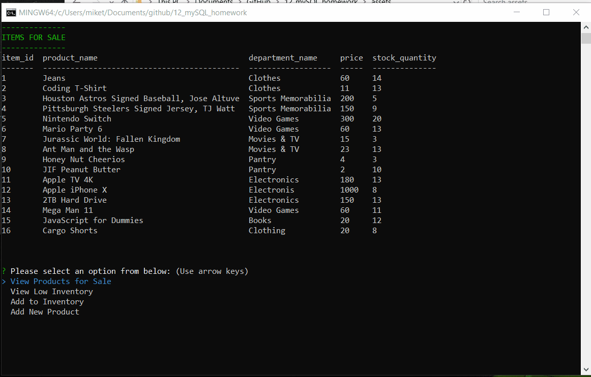

# Bamazon CLI

This is a command line interface that runs in the terminal on node.js.  It connects to a database through a local host port where the user's computer is acting as the server.

## Video Demonstration of Bamazon Customer and Manager Terminals
https://drive.google.com/file/d/1f0-rWXGBVkytLWDe5VUvUQO6mbVZ_zaY/view

# Challenge #1: Customer View (Minimum Requirement)

1. Utilizes a database called bamazon created in mySQL.
2. The database includes a table called products with the following columns:
    a. item_id (unique id for each product)
    b. product_name (Name of product)
    c. department_name
    d. price (cost to customer)
    e. stock_quantity (how much of the product is available in stores)
3. 10 items are generated in mySQL to be saved in the bamazon Store.
4. A node.js application is created that will display a full table list of items to the user.
5. The application promps the user with two messages
    a. What is the ID of the product they would like to buy.
    b. How many units of the product they have chose they would like to buy.
6. If quanity of the product is sufficient, display the total they have paid and fullfill the order.

7. if quantity of the product is insufficient, display a message that let them know to change the quanity.
If not, the app should log a phrase like Insufficient quantity!, and then prevent the order from going through.
However, if your store does have enough of the product, you should fulfill the customer's order.

# Challenge #2: Manager View (Next Level)
Create a new Node application called bamazonManager.js. Running this application will:

List a set of menu options:

## 1. View Products for Sale

If a manager selects View Products for Sale, the app should list every available item: the item IDs, names, prices, and quantities.

## 2. View Low Inventory

If a manager selects View Low Inventory, then it should list all items with an inventory count lower than five.

## 3. Add to Inventory

If a manager selects Add to Inventory, your app should display a prompt that will let the manager "add more" of any item currently in the store.

## 4. Add New Product

If a manager selects Add New Product, it should allow the manager to add a completely new product to the store.

;

 